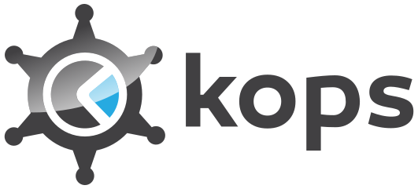

[](https://github.com/opspec-pkgs/kops.aws.kubeconfig.get/actions/workflows/build.yml)




# Problem statement

retrieve a kubeconfig for a kubernetes cluster managed by kops in aws

# Example usage

## Visualize

```shell
opctl ui github.com/opspec-pkgs/kops.aws.kubeconfig.get#1.0.0
```

## Run

```
opctl run github.com/opspec-pkgs/kops.aws.kubeconfig.get#1.0.0
```

## Compose

```yaml
op:
  ref: github.com/opspec-pkgs/kops.aws.kubeconfig.get#1.0.0
  inputs:
    AWS_ACCESS_KEY_ID:  # 👈 required; provide a value
    AWS_SECRET_ACCESS_KEY:  # 👈 required; provide a value
    kopsStateStore:  # 👈 required; provide a value
    name:  # 👈 required; provide a value
  ## uncomment to override defaults
  #   region: "us-west-2"
  outputs:
    kubeConfig:
```

# Support

join us on
[](https://join.slack.com/t/opctl/shared_invite/zt-51zodvjn-Ul_UXfkhqYLWZPQTvNPp5w)
or
[open an issue](https://github.com/opspec-pkgs/kops.aws.kubeconfig.get/issues)

# Releases

releases are versioned according to
[](http://semver.org/spec/v2.0.0.html)
and [tagged](https://git-scm.com/book/en/v2/Git-Basics-Tagging); see
[CHANGELOG.md](CHANGELOG.md) for release notes

# Contributing

see
[project/CONTRIBUTING.md](https://github.com/opspec-pkgs/project/blob/main/CONTRIBUTING.md)
